# LTZ (LobbyTwoZero) — ER Diyagramları

> Tarih: 2026-10-20
>
> Durum: Game Service Faz 1 diyagramı V31–V35 ile uygulanmış şemayı gösterir; diğer diyagramlar **`[ÖNERİ]`** olarak [database.md](database.md) içindeki tablo önerilerini gösterir. Bir servisin şeması değiştiğinde ilgili diyagram aynı değişiklikte güncellenir.
>
> Gösterim:
> - Düz çizgi / `FK`: aynı veritabanı içindeki gerçek yabancı anahtar.
> - Kesikli çizgi / `REF`: servisler arası **mantıksal** referans (yalnız `uuid`, FK constraint yok).
> - Teknik tablolar (`outbox_events`, `inbox_events`, `idempotency_records`, `audit_logs`) diyagramlarda gösterilmez; kuralları database.md §2.4'tedir.

## 1. Kavramsal (servisler arası) görünüm

```mermaid
flowchart TB
  subgraph auth_db
    ACC[accounts]
  end
  subgraph user_db
    PROF[user_profiles]
    LINK[linked_accounts]
  end
  subgraph game_db
    GAME[games]
  end
  subgraph library_db
    LIBE[library_entries]
  end
  subgraph review_db
    REVW[reviews]
  end
  subgraph social_db
    FRND[friendships]
    BLK[user_blocks]
  end
  subgraph messaging_db
    CONV[conversations]
    MSGS[messages]
  end
  subgraph lfp_db
    LST[lfp_listings]
  end
  subgraph community_db
    POST[posts]
  end
  subgraph content_db
    CNT[contents]
  end
  subgraph event_db
    EVT[events]
    PART[event_participations]
  end
  subgraph hardware_db
    HWP[hardware_profiles]
    HWPR[hardware_products]
  end
  subgraph performance_db
    DEV[devices]
    SES[performance_sessions]
  end
  subgraph recommendation_db
    RECI[recommendation_items]
  end
  subgraph notification_db
    NOTF[notifications]
  end
  subgraph admin_db
    CASE[moderation_cases]
  end

  PROF -. user_id .-> ACC
  LINK -. user_id .-> ACC
  LIBE -. user_id .-> ACC
  LIBE -. game_id .-> GAME
  REVW -. user_id .-> ACC
  REVW -. game_id .-> GAME
  FRND -. user ids .-> ACC
  BLK -. user ids .-> ACC
  MSGS -. sender_id .-> ACC
  LST -. owner_id .-> ACC
  LST -. game_id .-> GAME
  POST -. author_id .-> ACC
  POST -. game_id .-> GAME
  CNT -. author_id .-> ACC
  EVT -. game_id .-> GAME
  PART -. user_id .-> ACC
  HWP -. user_id .-> ACC
  DEV -. user_id .-> ACC
  DEV -. hardware_profile_id .-> HWP
  SES -. game_id .-> GAME
  RECI -. target_id .-> GAME
  RECI -. target_id .-> HWPR
  RECI -. target_id .-> EVT
  NOTF -. user_id .-> ACC
  CASE -. target_id .-> REVW
  CASE -. target_id .-> POST
```

Kanonik kimlikler: kullanıcı için `auth_db.accounts.id` (= `userId`), oyun için `game_db.games.id` (= `gameId`).

## 2. auth_db

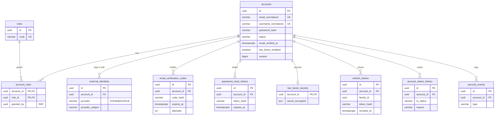
```mermaid
erDiagram
  accounts ||--o{ account_roles : has
  roles ||--o{ account_roles : grants
  accounts ||--o{ external_identities : "logs in with"
  accounts ||--o{ email_verification_codes : verifies
  accounts ||--o{ password_reset_tokens : resets
  accounts ||--o| two_factor_secrets : secures
  accounts ||--o{ refresh_tokens : issues
  accounts ||--o{ account_status_history : tracks
  accounts ||--o{ security_events : logs

  accounts {
    uuid id PK
    varchar email_normalized UK
    varchar username_normalized UK
    varchar password_hash
    varchar status
    timestamptz email_verified_at
    boolean two_factor_enabled
    bigint version
  }
  roles {
    uuid id PK
    varchar code UK
  }
  account_roles {
    uuid account_id PK,FK
    uuid role_id PK,FK
    uuid granted_by "REF"
  }
  external_identities {
    uuid id PK
    uuid account_id FK
    varchar provider "STEAM|GOOGLE"
    varchar provider_subject
  }
  email_verification_codes {
    uuid id PK
    uuid account_id FK
    varchar code_hash
    timestamptz expires_at
    int attempts
  }
  password_reset_tokens {
    uuid id PK
    uuid account_id FK
    varchar token_hash
    timestamptz expires_at
  }
  two_factor_secrets {
    uuid account_id PK,FK
    text secret_encrypted
  }
  refresh_tokens {
    uuid id PK
    uuid account_id FK
    uuid family_id
    varchar token_hash
    timestamptz revoked_at
  }
  account_status_history {
    uuid id PK
    uuid account_id FK
    varchar to_status
    varchar reason
  }
  security_events {
    uuid id PK
    uuid account_id FK
    varchar type
  }
```

## 3. user_db

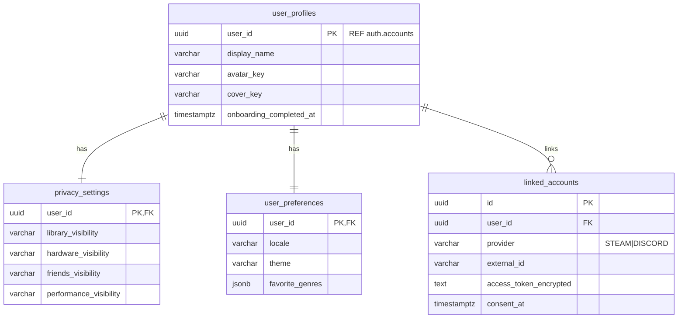
```mermaid
erDiagram
  user_profiles ||--|| privacy_settings : has
  user_profiles ||--|| user_preferences : has
  user_profiles ||--o{ linked_accounts : links

  user_profiles {
    uuid user_id PK "REF auth.accounts"
    varchar display_name
    varchar avatar_key
    varchar cover_key
    timestamptz onboarding_completed_at
  }
  privacy_settings {
    uuid user_id PK,FK
    varchar library_visibility
    varchar hardware_visibility
    varchar friends_visibility
    varchar performance_visibility
  }
  user_preferences {
    uuid user_id PK,FK
    varchar locale
    varchar theme
    jsonb favorite_genres
  }
  linked_accounts {
    uuid id PK
    uuid user_id FK
    varchar provider "STEAM|DISCORD"
    varchar external_id
    text access_token_encrypted
    timestamptz consent_at
  }
```

## 4. mail_db

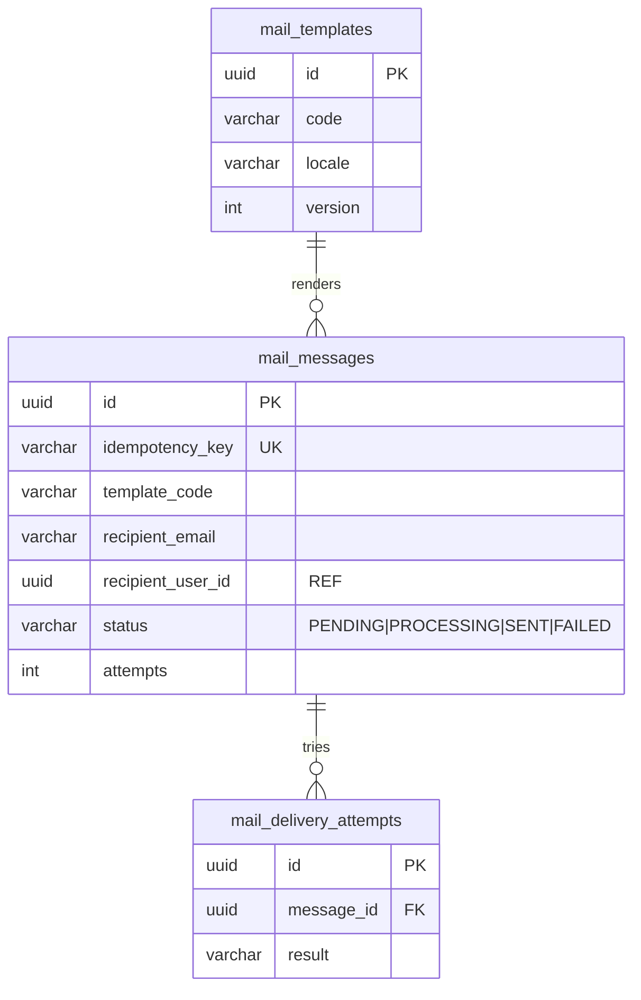
```mermaid
erDiagram
  mail_templates ||--o{ mail_messages : renders
  mail_messages ||--o{ mail_delivery_attempts : tries

  mail_templates {
    uuid id PK
    varchar code
    varchar locale
    int version
  }
  mail_messages {
    uuid id PK
    varchar idempotency_key UK
    varchar template_code
    varchar recipient_email
    uuid recipient_user_id "REF"
    varchar status "PENDING|PROCESSING|SENT|FAILED"
    int attempts
  }
  mail_delivery_attempts {
    uuid id PK
    uuid message_id FK
    varchar result
  }
```

## 5. game_db

Faz 6 / V172–V173 eklentisi (2026-10-21 tarihinde kullanıcı onayıyla DEV'e uygulandı):

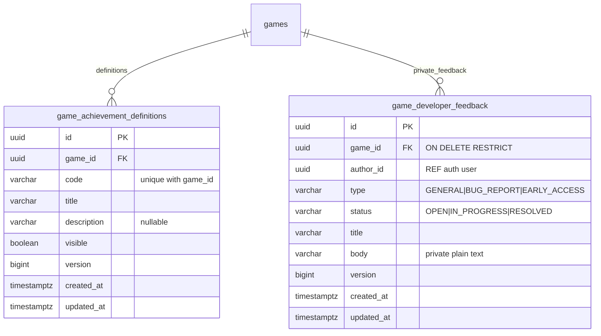
```mermaid
erDiagram
  games ||--o{ game_achievement_definitions : definitions
  games ||--o{ game_developer_feedback : private_feedback
  game_achievement_definitions {
    uuid id PK
    uuid game_id FK
    varchar code "unique with game_id"
    varchar title
    varchar description "nullable"
    boolean visible
    bigint version
    timestamptz created_at
    timestamptz updated_at
  }
  game_developer_feedback {
    uuid id PK
    uuid game_id FK "ON DELETE RESTRICT"
    uuid author_id "REF auth user"
    varchar type "GENERAL|BUG_REPORT|EARLY_ACCESS"
    varchar status "OPEN|IN_PROGRESS|RESOLVED"
    varchar title
    varchar body "private plain text"
    bigint version
    timestamptz created_at
    timestamptz updated_at
  }
```

GAME-23/V171 eklentisi (eski `game_languages` ilişkisi aynen korunur):

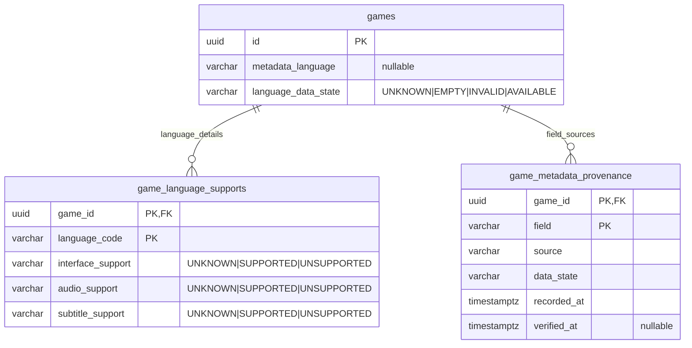
```mermaid
erDiagram
  games ||--o{ game_language_supports : language_details
  games ||--o{ game_metadata_provenance : field_sources
  games {
    uuid id PK
    varchar metadata_language "nullable"
    varchar language_data_state "UNKNOWN|EMPTY|INVALID|AVAILABLE"
  }
  game_language_supports {
    uuid game_id PK,FK
    varchar language_code PK
    varchar interface_support "UNKNOWN|SUPPORTED|UNSUPPORTED"
    varchar audio_support "UNKNOWN|SUPPORTED|UNSUPPORTED"
    varchar subtitle_support "UNKNOWN|SUPPORTED|UNSUPPORTED"
  }
  game_metadata_provenance {
    uuid game_id PK,FK
    varchar field PK
    varchar source
    varchar data_state
    timestamptz recorded_at
    timestamptz verified_at "nullable"
  }
```

Ana Game Service şeması (V31–V40, GAME-23 için V171 eklentisi yukarıdadır); henüz uygulanmayan fiyat bilgileri dahil edilmemiştir. Popülerlik bu aşamada editör seçimidir. V38–V40 ile Game Service migration aralığı (V31–V40) dolmuştur.

```mermaid
erDiagram
  games ||--o{ game_external_refs : references
  game_external_refs ||--o{ game_identity_audits : audited_by
  games ||--o{ game_identity_audits : identity_history
  games ||--o{ game_terms : has
  catalog_terms ||--o{ game_terms : classifies
  games ||--o{ game_developers : developed_by
  games ||--o{ game_publishers : published_by
  games ||--o{ game_media : shows
  games ||--o{ game_system_requirements : requires
  games ||--o{ game_languages : supports
  games ||--o{ game_field_overrides : locks
  games ||--o{ game_admin_audits : audited_by
  games ||--o{ game_developer_grants : grants
  games ||--o| game_developer_contents : describes
  games ||--o{ game_developer_media : links
  games ||--o{ game_update_notes : announces
  games {
    uuid id PK
    varchar title
    varchar game_type
    varchar origin
    varchar metadata_completeness
    varchar status
    varchar normalized_title
    varchar description
    date release_date
    boolean early_access
    int editor_rank UK
    timestamptz popularity_updated_at
    uuid editor_actor_id "REF"
    varchar editor_evidence
    timestamptz details_fetched_at
    timestamptz details_expires_at
    timestamptz details_next_attempt_at
    int details_failure_count
    varchar details_last_error_code
    timestamptz created_at
    timestamptz updated_at
    bigint version
  }
  game_languages {
    uuid game_id PK,FK
    varchar language_code PK
  }
  game_external_refs {
    uuid id PK
    uuid game_id FK
    varchar provider "UK(provider,external_id)"
    varchar external_id
    timestamptz last_synced_at
    bigint version
  }
  game_identity_audits {
    uuid id PK
    uuid reference_id FK
    uuid from_game_id FK
    uuid to_game_id FK
    uuid actor_id "REF"
    varchar action
    varchar evidence
    timestamptz created_at
  }
  game_provider_sync_state {
    uuid id PK
    varchar provider UK
    bigint cursor
    varchar run_mode
    varchar sync_status
    timestamptz query_since
    timestamptz last_successful_at
    bigint processed_count
    int failure_count
    timestamptz next_attempt_at
    bigint version
  }
  catalog_terms {
    uuid id PK
    varchar kind "GENRE|CATEGORY|TAG|PLATFORM"
    varchar code "UK(kind,code)"
    varchar name_tr
    varchar name_en
    bigint version
  }
  game_terms {
    uuid game_id PK,FK
    uuid term_id PK,FK
  }
  game_developers {
    uuid game_id PK,FK
    varchar name PK
  }
  game_publishers {
    uuid game_id PK,FK
    varchar name PK
  }
  game_media {
    uuid id PK
    uuid game_id FK
    varchar type
    varchar url
    bigint version
  }
  game_system_requirements {
    uuid id PK
    uuid game_id FK
    varchar platform
    varchar level
    int ram_mb
    bigint version
  }
  game_field_overrides {
    uuid id PK
    uuid game_id FK "UK(game_id,field)"
    varchar field "TITLE|DESCRIPTION|RELEASE_DATE|GAME_TYPE|DEVELOPERS|PUBLISHERS"
    uuid actor_id "REF"
    timestamptz created_at
    bigint version
  }
  game_admin_audits {
    uuid id PK
    uuid game_id FK "nullable"
    uuid actor_id "REF"
    varchar actor_role "ADMIN|MODERATOR|GAME_DEVELOPER"
    varchar action
    varchar reason
    varchar details
    timestamptz created_at
  }
  game_developer_grants {
    uuid id PK
    uuid game_id FK "partial UK(game_id,developer_user_id) where revoked_at is null"
    uuid developer_user_id "REF"
    uuid granted_by "REF"
    timestamptz granted_at
    uuid revoked_by "REF"
    timestamptz revoked_at
    bigint version
  }
  game_developer_contents {
    uuid game_id PK,FK
    varchar description
    uuid author_id "REF"
    varchar status "VISIBLE|HIDDEN"
    uuid moderated_by "REF"
    varchar moderation_reason
    timestamptz moderated_at
    bigint version
  }
  game_developer_media {
    uuid id PK
    uuid game_id FK
    uuid author_id "REF"
    varchar type "IMAGE|VIDEO|DEMO"
    varchar url "https"
    varchar alt_text
    varchar status "VISIBLE|HIDDEN|DELETED"
    uuid moderated_by "REF"
    bigint version
  }
  game_update_notes {
    uuid id PK
    uuid game_id FK
    uuid author_id "REF"
    varchar title
    varchar body
    varchar status "VISIBLE|HIDDEN|DELETED"
    uuid moderated_by "REF"
    bigint version
  }
```

## 6. library_db

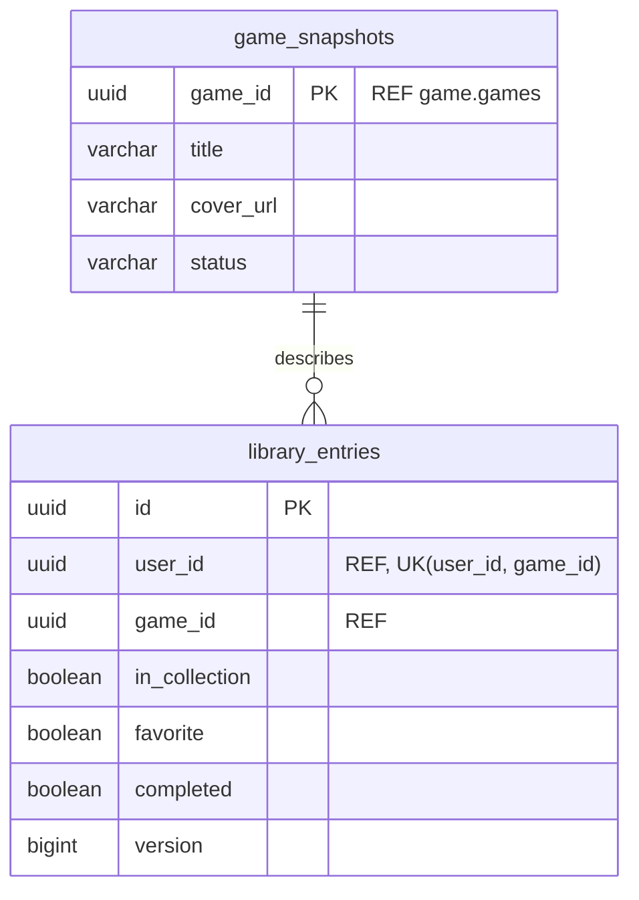
```mermaid
erDiagram
  game_snapshots ||--o{ library_entries : describes

  library_entries {
    uuid id PK
    uuid user_id "REF, UK(user_id, game_id)"
    uuid game_id "REF"
    boolean in_collection
    boolean favorite
    boolean completed
    bigint version
  }
  game_snapshots {
    uuid game_id PK "REF game.games"
    varchar title
    varchar cover_url
    varchar status
  }
```

> `game_snapshots` → `library_entries` ilişkisi mantıksaldır (aynı DB, FK zorunlu değil); oyun snapshot'ı event ile gelir.

## 7. review_db

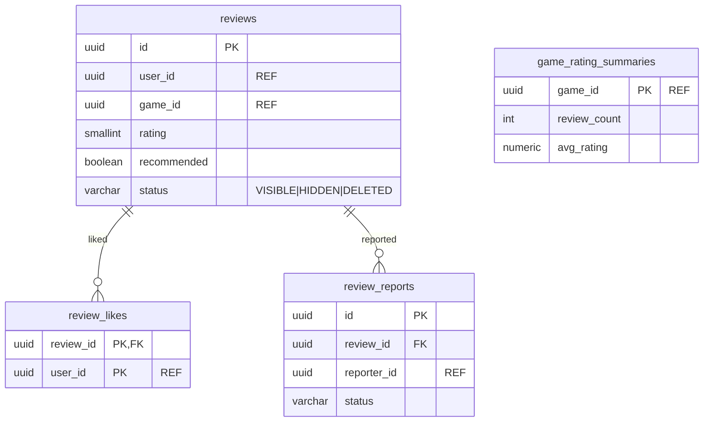
```mermaid
erDiagram
  reviews ||--o{ review_likes : liked
  reviews ||--o{ review_reports : reported

  reviews {
    uuid id PK
    uuid user_id "REF"
    uuid game_id "REF"
    smallint rating
    boolean recommended
    varchar status "VISIBLE|HIDDEN|DELETED"
  }
  review_likes {
    uuid review_id PK,FK
    uuid user_id PK "REF"
  }
  review_reports {
    uuid id PK
    uuid review_id FK
    uuid reporter_id "REF"
    varchar status
  }
  game_rating_summaries {
    uuid game_id PK "REF"
    int review_count
    numeric avg_rating
  }
```

## 8. social_db

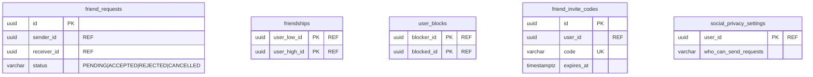
```mermaid
erDiagram
  friend_requests {
    uuid id PK
    uuid sender_id "REF"
    uuid receiver_id "REF"
    varchar status "PENDING|ACCEPTED|REJECTED|CANCELLED"
  }
  friendships {
    uuid user_low_id PK "REF"
    uuid user_high_id PK "REF"
  }
  user_blocks {
    uuid blocker_id PK "REF"
    uuid blocked_id PK "REF"
  }
  friend_invite_codes {
    uuid id PK
    uuid user_id "REF"
    varchar code UK
    timestamptz expires_at
  }
  social_privacy_settings {
    uuid user_id PK "REF"
    varchar who_can_send_requests
  }
```

## 9. messaging_db

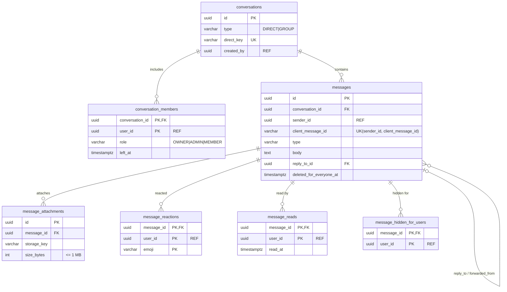
```mermaid
erDiagram
  conversations ||--o{ conversation_members : includes
  conversations ||--o{ messages : contains
  messages ||--o{ message_attachments : attaches
  messages ||--o{ message_reactions : reacted
  messages ||--o{ message_reads : "read by"
  messages ||--o{ message_hidden_for_users : "hidden for"
  messages |o--o{ messages : "reply_to / forwarded_from"

  conversations {
    uuid id PK
    varchar type "DIRECT|GROUP"
    varchar direct_key UK
    uuid created_by "REF"
  }
  conversation_members {
    uuid conversation_id PK,FK
    uuid user_id PK "REF"
    varchar role "OWNER|ADMIN|MEMBER"
    timestamptz left_at
  }
  messages {
    uuid id PK
    uuid conversation_id FK
    uuid sender_id "REF"
    varchar client_message_id "UK(sender_id, client_message_id)"
    varchar type
    text body
    uuid reply_to_id FK
    timestamptz deleted_for_everyone_at
  }
  message_attachments {
    uuid id PK
    uuid message_id FK
    varchar storage_key
    int size_bytes "<= 1 MB"
  }
  message_reactions {
    uuid message_id PK,FK
    uuid user_id PK "REF"
    varchar emoji PK
  }
  message_reads {
    uuid message_id PK,FK
    uuid user_id PK "REF"
    timestamptz read_at
  }
  message_hidden_for_users {
    uuid message_id PK,FK
    uuid user_id PK "REF"
  }
```

## 10. lfp_db

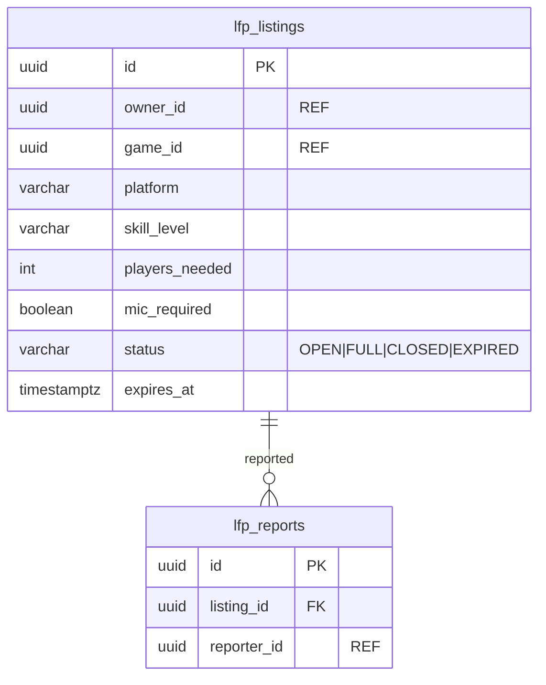
```mermaid
erDiagram
  lfp_listings ||--o{ lfp_reports : reported

  lfp_listings {
    uuid id PK
    uuid owner_id "REF"
    uuid game_id "REF"
    varchar platform
    varchar skill_level
    int players_needed
    boolean mic_required
    varchar status "OPEN|FULL|CLOSED|EXPIRED"
    timestamptz expires_at
  }
  lfp_reports {
    uuid id PK
    uuid listing_id FK
    uuid reporter_id "REF"
  }
```

## 11. community_db

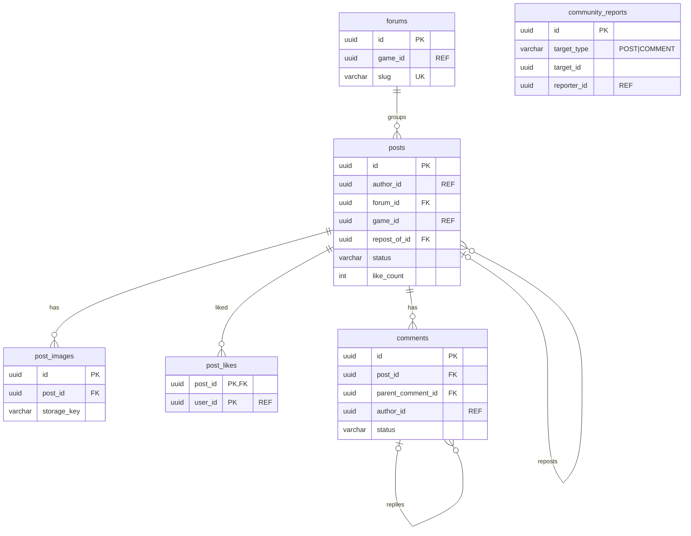
```mermaid
erDiagram
  forums ||--o{ posts : groups
  posts ||--o{ post_images : has
  posts ||--o{ post_likes : liked
  posts ||--o{ comments : has
  comments |o--o{ comments : replies
  posts |o--o{ posts : reposts

  forums {
    uuid id PK
    uuid game_id "REF"
    varchar slug UK
  }
  posts {
    uuid id PK
    uuid author_id "REF"
    uuid forum_id FK
    uuid game_id "REF"
    uuid repost_of_id FK
    varchar status
    int like_count
  }
  post_images {
    uuid id PK
    uuid post_id FK
    varchar storage_key
  }
  post_likes {
    uuid post_id PK,FK
    uuid user_id PK "REF"
  }
  comments {
    uuid id PK
    uuid post_id FK
    uuid parent_comment_id FK
    uuid author_id "REF"
    varchar status
  }
  community_reports {
    uuid id PK
    varchar target_type "POST|COMMENT"
    uuid target_id
    uuid reporter_id "REF"
  }
```

## 12. content_db

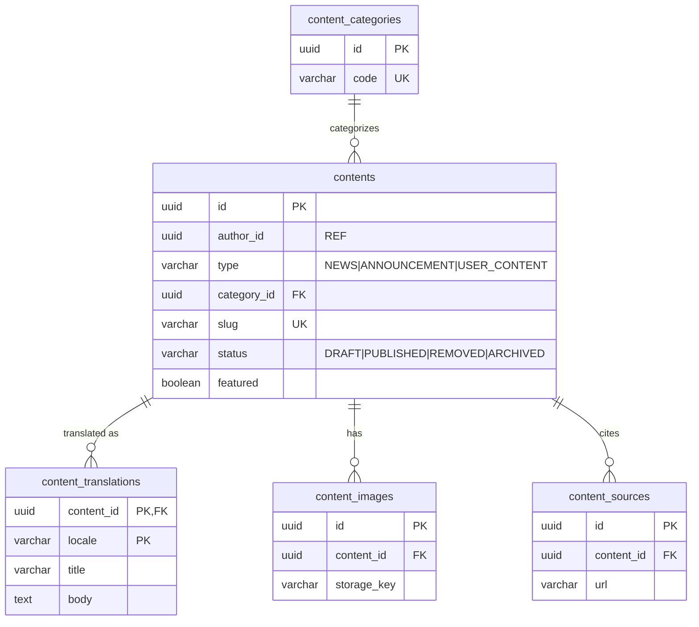
```mermaid
erDiagram
  content_categories ||--o{ contents : categorizes
  contents ||--o{ content_translations : "translated as"
  contents ||--o{ content_images : has
  contents ||--o{ content_sources : cites

  content_categories {
    uuid id PK
    varchar code UK
  }
  contents {
    uuid id PK
    uuid author_id "REF"
    varchar type "NEWS|ANNOUNCEMENT|USER_CONTENT"
    uuid category_id FK
    varchar slug UK
    varchar status "DRAFT|PUBLISHED|REMOVED|ARCHIVED"
    boolean featured
  }
  content_translations {
    uuid content_id PK,FK
    varchar locale PK
    varchar title
    text body
  }
  content_images {
    uuid id PK
    uuid content_id FK
    varchar storage_key
  }
  content_sources {
    uuid id PK
    uuid content_id FK
    varchar url
  }
```

## 13. event_db

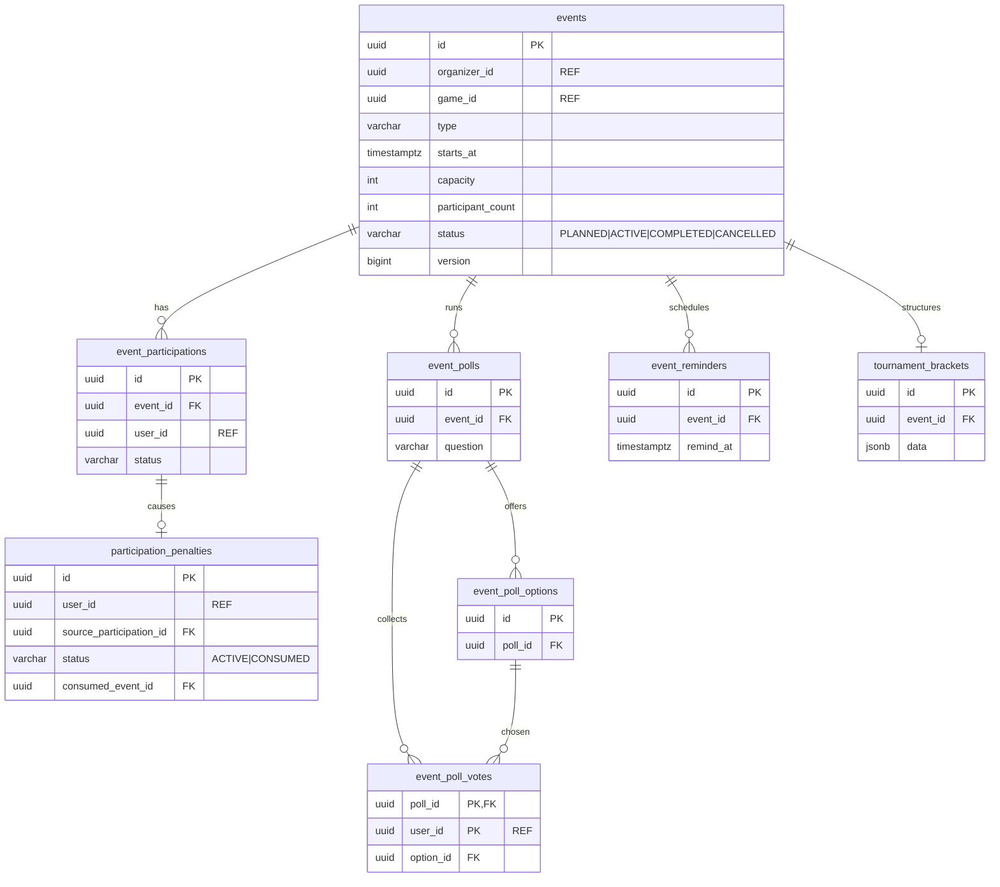
```mermaid
erDiagram
  events ||--o{ event_participations : has
  event_participations ||--o| participation_penalties : causes
  events ||--o{ event_polls : runs
  event_polls ||--o{ event_poll_options : offers
  event_polls ||--o{ event_poll_votes : collects
  event_poll_options ||--o{ event_poll_votes : chosen
  events ||--o{ event_reminders : schedules
  events ||--o| tournament_brackets : structures

  events {
    uuid id PK
    uuid organizer_id "REF"
    uuid game_id "REF"
    varchar type
    timestamptz starts_at
    int capacity
    int participant_count
    varchar status "PLANNED|ACTIVE|COMPLETED|CANCELLED"
    bigint version
  }
  event_participations {
    uuid id PK
    uuid event_id FK
    uuid user_id "REF"
    varchar status
  }
  participation_penalties {
    uuid id PK
    uuid user_id "REF"
    uuid source_participation_id FK
    varchar status "ACTIVE|CONSUMED"
    uuid consumed_event_id FK
  }
  event_polls {
    uuid id PK
    uuid event_id FK
    varchar question
  }
  event_poll_options {
    uuid id PK
    uuid poll_id FK
  }
  event_poll_votes {
    uuid poll_id PK,FK
    uuid user_id PK "REF"
    uuid option_id FK
  }
  event_reminders {
    uuid id PK
    uuid event_id FK
    timestamptz remind_at
  }
  tournament_brackets {
    uuid id PK
    uuid event_id FK
    jsonb data
  }
```

## 14. hardware_db

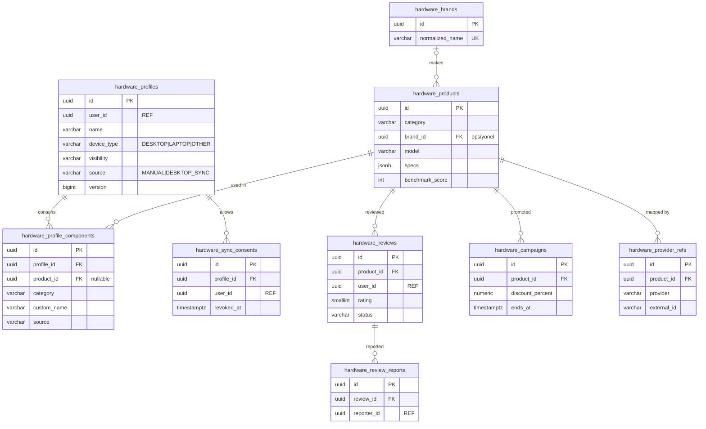
```mermaid
erDiagram
  hardware_brands |o--o{ hardware_products : makes
  hardware_products ||--o{ hardware_profile_components : "used in"
  hardware_profiles ||--o{ hardware_profile_components : contains
  hardware_profiles ||--o{ hardware_sync_consents : allows
  hardware_products ||--o{ hardware_reviews : reviewed
  hardware_reviews ||--o{ hardware_review_reports : reported
  hardware_products ||--o{ hardware_campaigns : promoted
  hardware_products ||--o{ hardware_provider_refs : "mapped by"

  hardware_brands {
    uuid id PK
    varchar normalized_name UK
  }
  hardware_products {
    uuid id PK
    varchar category
    uuid brand_id FK "opsiyonel"
    varchar model
    jsonb specs
    int benchmark_score
  }
  hardware_profiles {
    uuid id PK
    uuid user_id "REF"
    varchar name
    varchar device_type "DESKTOP|LAPTOP|OTHER"
    varchar visibility
    varchar source "MANUAL|DESKTOP_SYNC"
    bigint version
  }
  hardware_profile_components {
    uuid id PK
    uuid profile_id FK
    uuid product_id FK "nullable"
    varchar category
    varchar custom_name
    varchar source
  }
  hardware_sync_consents {
    uuid id PK
    uuid profile_id FK
    uuid user_id "REF"
    timestamptz revoked_at
  }
  hardware_reviews {
    uuid id PK
    uuid product_id FK
    uuid user_id "REF"
    smallint rating
    varchar status
  }
  hardware_review_reports {
    uuid id PK
    uuid review_id FK
    uuid reporter_id "REF"
  }
  hardware_campaigns {
    uuid id PK
    uuid product_id FK
    numeric discount_percent
    timestamptz ends_at
  }
  hardware_provider_refs {
    uuid id PK
    uuid product_id FK
    varchar provider
    varchar external_id
  }
```

## 15. recommendation_db

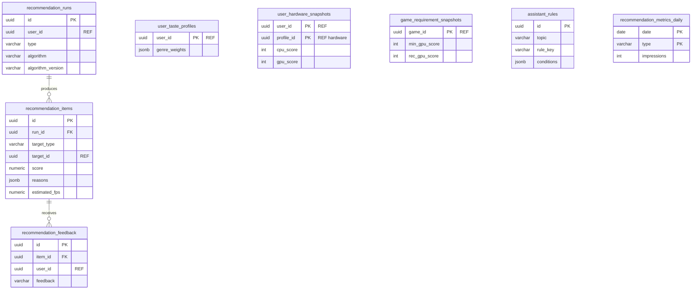
```mermaid
erDiagram
  recommendation_runs ||--o{ recommendation_items : produces
  recommendation_items ||--o{ recommendation_feedback : receives

  user_taste_profiles {
    uuid user_id PK "REF"
    jsonb genre_weights
  }
  user_hardware_snapshots {
    uuid user_id PK "REF"
    uuid profile_id PK "REF hardware"
    int cpu_score
    int gpu_score
  }
  game_requirement_snapshots {
    uuid game_id PK "REF"
    int min_gpu_score
    int rec_gpu_score
  }
  recommendation_runs {
    uuid id PK
    uuid user_id "REF"
    varchar type
    varchar algorithm
    varchar algorithm_version
  }
  recommendation_items {
    uuid id PK
    uuid run_id FK
    varchar target_type
    uuid target_id "REF"
    numeric score
    jsonb reasons
    numeric estimated_fps
  }
  recommendation_feedback {
    uuid id PK
    uuid item_id FK
    uuid user_id "REF"
    varchar feedback
  }
  assistant_rules {
    uuid id PK
    varchar topic
    varchar rule_key
    jsonb conditions
  }
  recommendation_metrics_daily {
    date date PK
    varchar type PK
    int impressions
  }
```

## 16. performance_db

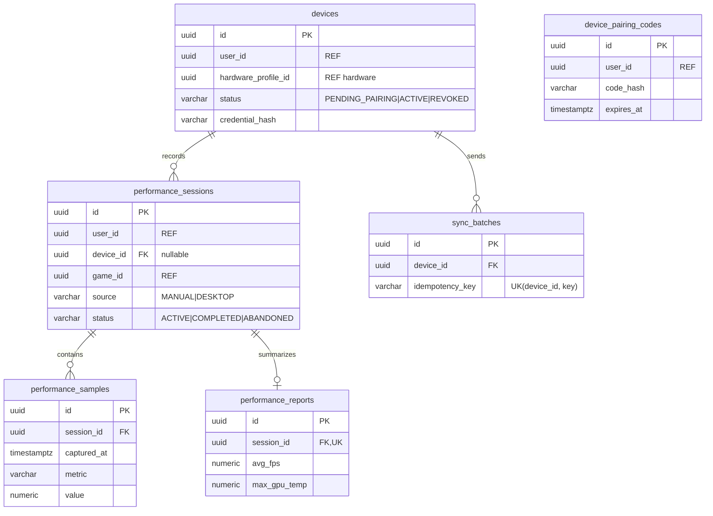
```mermaid
erDiagram
  devices ||--o{ performance_sessions : records
  performance_sessions ||--o{ performance_samples : contains
  performance_sessions ||--o| performance_reports : summarizes
  devices ||--o{ sync_batches : sends

  devices {
    uuid id PK
    uuid user_id "REF"
    uuid hardware_profile_id "REF hardware"
    varchar status "PENDING_PAIRING|ACTIVE|REVOKED"
    varchar credential_hash
  }
  device_pairing_codes {
    uuid id PK
    uuid user_id "REF"
    varchar code_hash
    timestamptz expires_at
  }
  performance_sessions {
    uuid id PK
    uuid user_id "REF"
    uuid device_id FK "nullable"
    uuid game_id "REF"
    varchar source "MANUAL|DESKTOP"
    varchar status "ACTIVE|COMPLETED|ABANDONED"
  }
  performance_samples {
    uuid id PK
    uuid session_id FK
    timestamptz captured_at
    varchar metric
    numeric value
  }
  performance_reports {
    uuid id PK
    uuid session_id FK,UK
    numeric avg_fps
    numeric max_gpu_temp
  }
  sync_batches {
    uuid id PK
    uuid device_id FK
    varchar idempotency_key "UK(device_id, key)"
  }
```

## 17. admin_db

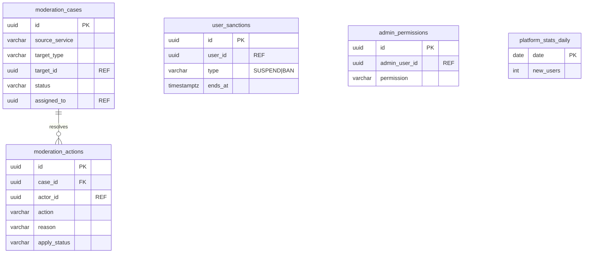
```mermaid
erDiagram
  moderation_cases ||--o{ moderation_actions : resolves

  moderation_cases {
    uuid id PK
    varchar source_service
    varchar target_type
    uuid target_id "REF"
    varchar status
    uuid assigned_to "REF"
  }
  moderation_actions {
    uuid id PK
    uuid case_id FK
    uuid actor_id "REF"
    varchar action
    varchar reason
    varchar apply_status
  }
  user_sanctions {
    uuid id PK
    uuid user_id "REF"
    varchar type "SUSPEND|BAN"
    timestamptz ends_at
  }
  admin_permissions {
    uuid id PK
    uuid admin_user_id "REF"
    varchar permission
  }
  platform_stats_daily {
    date date PK
    int new_users
  }
```

## 18. notification_db

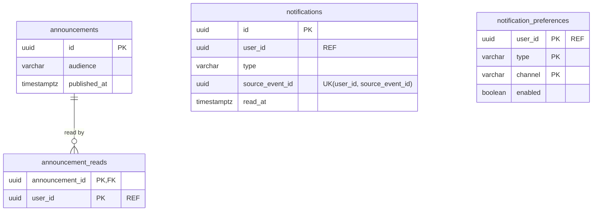
```mermaid
erDiagram
  announcements ||--o{ announcement_reads : "read by"

  notifications {
    uuid id PK
    uuid user_id "REF"
    varchar type
    uuid source_event_id "UK(user_id, source_event_id)"
    timestamptz read_at
  }
  notification_preferences {
    uuid user_id PK "REF"
    varchar type PK
    varchar channel PK
    boolean enabled
  }
  announcements {
    uuid id PK
    varchar audience
    timestamptz published_at
  }
  announcement_reads {
    uuid announcement_id PK,FK
    uuid user_id PK "REF"
  }
```
